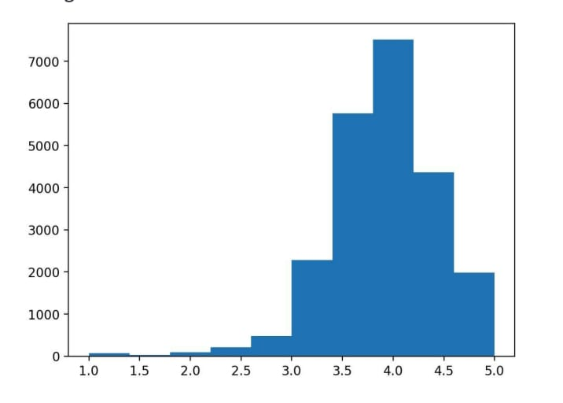
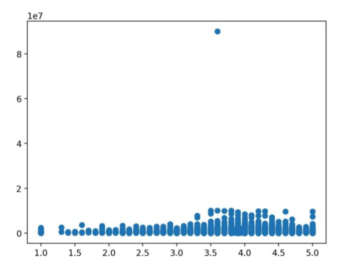
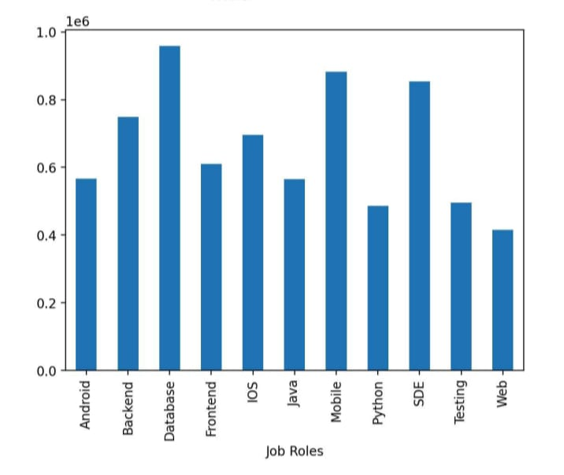
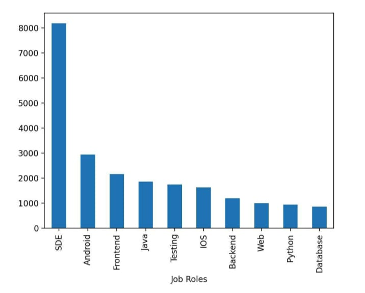

# Salary Data Analysis

## 📌 Project Overview
This project focuses on analyzing salary data to understand patterns, trends, and insights using data analysis techniques.

The analysis helps in identifying salary distribution, factors affecting salary, and useful insights for decision-making.

---

## 📊 Output Screenshots

### Output 1

### Output 2

### Output 3

### Output 4

### Output 5

## 🎯 Objectives
- To analyze salary data using Python
- To visualize salary trends and patterns
- To understand the relationship between different variables affecting salary
- To gain insights from the dataset

---

## 🛠️ Tools & Technologies Used
- Python
- Pandas
- Matplotlib
- Google Colab

---

## 📁 Project Files
- `dataset.csv` → يحتوي على بيانات الرواتب (salary dataset)
- `salary_analysis.ipynb` → notebook containing full analysis
- `Colab_Link.md` → contains Google Colab link

---

## 🔗 Google Colab Link
You can view and run the project using the link below:

[Open in Google Colab](https://colab.research.google.com/drive/1tawArBCduwH0mPwYKqzjhMJ1-m-_Dc8t?usp=sharing)

---

## 📊 Key Insights
- Salary distribution varies based on location and experience
- Higher experience generally leads to higher salary
- Data visualization helps in better understanding trends

---

## 👩‍💻 Author
**Harini Periyannan**

---

## 📌 Conclusion
This project demonstrates how data analysis techniques can be used to extract meaningful insights from salary data. It also highlights the importance of visualization in understanding data.

---
